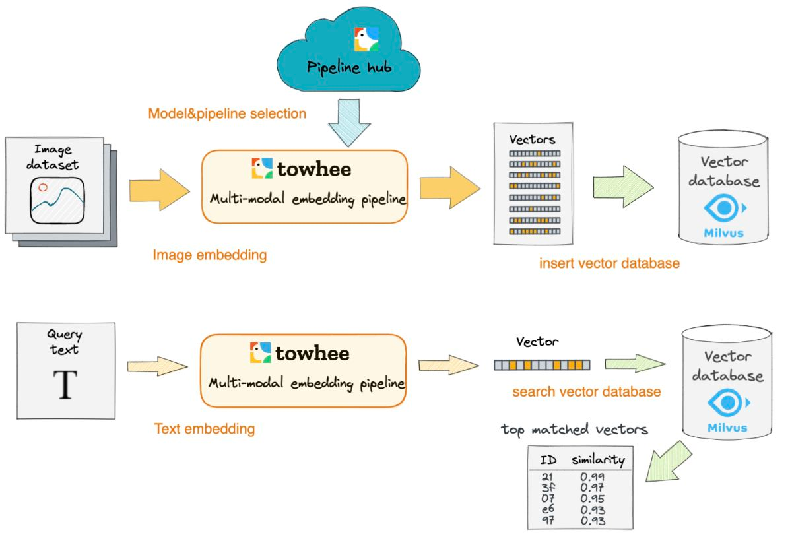

# extract_feature

此项目为提取图片、视频、音频等特征学习，最后通过完成多模态检索中图片搜图片、图片搜视频、音频搜音频等功能，验收学习效果

## 图片近似检索

实现步骤：
- towhee提取图片特征
- milvus入库图片特征
- 图片检索

架构图：

## 学习资料

towhee github：https://github.com/towhee-io/towhee
towhee 生成图片特征：https://towhee.io/image-text-embedding/taiyi
milvus 官网：https://milvus.io/
milvus github：https://github.com/milvus-io